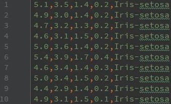
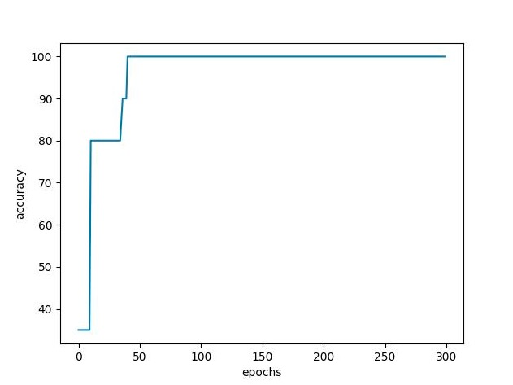

在上篇中我们详细介绍了BP算法的原理和推导过程，并且用实际的数据进行了计算演练。在下篇中，我们将自己实现BP算法（不使用第三方的算法框架），并用来解决鸢尾花分类问题。


鸢尾花数据集如图2所示，总共有三个品种的鸢尾花（setosa、versicolor和virginica），每个类别50条样本数据，每个样本有四个特征（花萼长度、花萼宽度、花瓣长度以及花瓣宽度）。




首先我们导入需要的包：


``` python
from csv import reader
import numpy as np
from sklearn.preprocessing import MinMaxScaler
import random
import matplotlib.pyplot as plt
import math
```


接下来我们实现一个数据集的加载和预处理的函数`load_dataset`：

``` python
def load_dataset(dataset_path, n_train_data):
    """加载数据集，对数据进行预处理，并划分训练集和验证集
    :param dataset_path: 数据集文件路径
    :param n_train_data: 训练集的数据量
    :return: 划分好的训练集和验证集
    """
    dataset = []
    label_dict = {'Iris-setosa': 0, 'Iris-versicolor': 1, 'Iris-virginica': 2}
    with open(dataset_path, 'r') as file:
        # 读取CSV文件，以逗号为分隔符
        csv_reader = reader(file, delimiter=',')
        for row in csv_reader:
            # 将字符串类型的特征值转换为浮点型
            row[0:4] = list(map(float, row[0:4]))
            # 将标签替换为整型
            row[4] = label_dict[row[4]]
            # 将处理好的数据加入数据集中
            dataset.append(row)

    # 对数据进行归一化处理
    dataset = np.array(dataset)
    mms = MinMaxScaler()
    for i in range(dataset.shape[1] - 1):
        dataset[:, i] = mms.fit_transform(dataset[:, i].reshape(-1, 1)).flatten()

    # 将类标转为整型
    dataset = dataset.tolist()
    for row in dataset:
        row[4] = int(row[4])
    # 打乱数据集
    random.shuffle(dataset)

    # 划分训练集和验证集
    train_data = dataset[0:n_train_data]
    val_data = dataset[n_train_data:]

    return train_data, val_data
```

在`load_dataset`函数中，我们实现了数据集的读取、数据的归一化处理以及对数据集进行了`shuffle`操作等，最后函数返回了划分好的训练集和验证集。

实现数据预处理之后，接下来我们开始实现BP算法的关键部分（**如果读者对算法原理有不清楚的地方，可以查看"一文彻底搞懂BP算法：原理推导+数据演示+项目实战（上篇）"**）。首先我们实现神经元的计算部分、激活函数以及激活函数的求导部分。


``` python
def fun_z(weights, inputs):
    """计算神经元的输入：z = weight * inputs + b
    :param weights: 网络参数（权重矩阵和偏置项）
    :param inputs: 上一层神经元的输出
    :return: 当前层神经元的输入
    """
    bias_term = weights[-1]
    z = 0
    for i in range(len(weights)-1):
        z += weights[i] * inputs[i]
    z += bias_term
    return z


def sigmoid(z):
    """激活函数(Sigmoid)：f(z) = Sigmoid(z)
    :param z: 神经元的输入
    :return: 神经元的输出
    """
    return 1.0 / (1.0 + math.exp(-z))


def sigmoid_derivative(output):
    """Sigmoid激活函数求导
    :param output: 激活函数的输出值
    :return: 求导计算结果
    """
    return output * (1.0 - output)
```


函数`fun_z`实现了公式"z = weight * inputs + b"，其中inputs是上一层网络的输出，weight是当前层的权重矩阵，b是当前层的偏置项，计算得到的z是当前层的输入。

函数`sigmoid`是Sigmoid激活函数的实现，将z作为激活函数的输入，计算得到当前层的输出，并传递到下一层。

函数`sigmoid_derivative`是Sigmoid函数求导的实现，在误差反向传播的时候需要用到。

接下来我们实现BP网络的前向传播：


``` python
def forward_propagate(network, inputs):
    """前向传播计算
    :param network: 神经网络
    :param inputs: 一个样本数据
    :return: 前向传播计算的结果
    """
    for layer in network:  # 循环计算每一层
        new_inputs = []
        for neuron in layer:  # 循环计算每一层的每一个神经元
            z = fun_z(neuron['weights'], inputs)
            neuron['output'] = sigmoid(z)
            new_inputs.append(neuron['output'])
        inputs = new_inputs
    return inputs
```


前向计算的过程比较简单，和我们在上篇中介绍的计算过程一致。稍微麻烦一点的是误差反向传播的计算：


``` python
def backward_propagate_error(network, actual_label):
    """误差进行反向传播
    :param network: 神经网络
    :param actual_label: 真实的标签值
    :return:
    """
    for i in reversed(range(len(network))):  # 从最后一层开始计算误差
        layer = network[i]
        errors = list()
        if i != len(network)-1:  # 不是输出层
            for j in range(len(layer)):  # 计算每一个神经元的误差
                error = 0.0
                for neuron in network[i + 1]:
                    error += (neuron['weights'][j] * neuron['delta'])
                errors.append(error)
        else:  # 输出层
            for j in range(len(layer)):  # 计算每一个神经元的误差
                neuron = layer[j]
                errors.append(actual_label[j] - neuron['output'])
        # 计算误差项 delta
        for j in range(len(layer)):
            neuron = layer[j]
            neuron['delta'] = errors[j] * sigmoid_derivative(neuron['output'])
```


误差反向传播过程中，我们首先需要根据模型的输出来计算得到误差，然后计算输出层的误差项。得到输出层的误差项之后，我们就可以根据上篇中介绍的"第k层神经元的误差项是由第k+1层的误差项乘以第k+1层的权重，再乘以第k层激活函数的导数得到"来计算其它层的误差项。

在计算得到每一层的误差项之后，我们根据上篇中介绍的权重矩阵和偏置项的更新公式来更新参数：


``` python
def update_parameters(network, row, l_rate):
    """利用误差更新神经网络的参数（权重矩阵和偏置项）
    :param network: 神经网络
    :param row: 一个样本数据
    :param l_rate: 学习率
    :return:
    """
    for i in range(len(network)):
        inputs = row[:-1]
        if i != 0:  # 获取上一层网络的输出
            inputs = [neuron['output'] for neuron in network[i - 1]]
        for neuron in network[i]:
            # 更新权重矩阵
            for j in range(len(inputs)):
                neuron['weights'][j] += l_rate * neuron['delta'] * inputs[j]
            # 更新偏置项
            neuron['weights'][-1] += l_rate * neuron['delta']
```


到这里所有的关键部分我们都已经实现了，接下来我们实现网络的初始化以及网络的训练部分，首先实现网络的初始化：


``` python
def initialize_network(n_inputs, n_hidden, n_outputs):
    """初始化BP网络（初始化隐藏层和输出层的参数：权重矩阵和偏置项）
    :param n_inputs: 特征列数
    :param n_hidden: 隐藏层神经元个数
    :param n_outputs: 输出层神经元个数，即分类的总类别数
    :return: 初始化后的神经网络
    """
    network = list()
    # 隐藏层
    hidden_layer = [{'weights': [random.random() for i in range(n_inputs + 1)]} for i in range(n_hidden)]
    network.append(hidden_layer)
    # 输出层
    output_layer = [{'weights': [random.random() for i in range(n_hidden + 1)]} for i in range(n_outputs)]
    network.append(output_layer)
    return network
```


这里我们初始化了一个两层神经网络（一个隐藏层和一个输出层）。在初始化参数的时候，我们将权重矩阵和偏置项放在了一个数组中（"weights"），数组的最后一个元素是偏置项，前面的元素是权重矩阵。

接下来我们实现模型的训练部分：


``` python
def train(train_data, l_rate, epochs, n_hidden, val_data):
    """训练神经网络（迭代n_epoch个回合）
    :param train_data: 训练集
    :param l_rate: 学习率
    :param epochs: 迭代的回合数
    :param n_hidden: 隐藏层神经元个数
    :param val_data: 验证集
    :return: 训练好的网络
    """
    # 获取特征列数
    n_inputs = len(train_data[0]) - 1
    # 获取分类的总类别数
    n_outputs = len(set([row[-1] for row in train_data]))
    # 初始化网络
    network = initialize_network(n_inputs, n_hidden, n_outputs)

    acc = []
    for epoch in range(epochs):  # 训练epochs个回合
        for row in train_data:
            # 前馈计算
            _ = forward_propagate(network, row)
            # 处理一下类标，用于计算误差
            actual_label = [0 for i in range(n_outputs)]
            actual_label[row[-1]] = 1
            # 误差反向传播计算
            backward_propagate_error(network, actual_label)
            # 更新参数
            update_parameters(network, row, l_rate)
        # 保存当前epoch模型在验证集上的准确率
        acc.append(validation(network, val_data))
    # 绘制出训练过程中模型在验证集上的准确率变化
    plt.xlabel('epochs')
    plt.ylabel('accuracy')
    plt.plot(acc)
    plt.show()

    return network
```


我们总共训练了`epochs`个回合，这里我们使用随机梯度下降来优化模型，因此每次都用一个样本来更新参数。接下来我们实现一个函数用来验证模型的效果：


``` python
def validation(network, val_data):
    """测试模型在验证集上的效果
    :param network: 神经网络
    :param val_data: 验证集
    :return: 模型在验证集上的准确率
    """
    # 获取预测类标
    predicted_label = []
    for row in val_data:
        prediction = predict(network, row)
        predicted_label.append(prediction)
    # 获取真实类标
    actual_label = [row[-1] for row in val_data]
    # 计算准确率
    accuracy = accuracy_calculation(actual_label, predicted_label)
    # print("测试集实际类标：", actual_label)
    # print("测试集上的预测类标：", predicted_label)
    return accuracy
```


训练过程中的每一个回合，我们都用模型对验证集进行一次预测，并将预测的结果保存，用来绘制训练过程中模型在验证集上的准确率的变化过程。准确率的计算以及使用模型进行预测的实现如下：


``` python
def accuracy_calculation(actual_label, predicted_label):
    """计算准确率
    :param actual_label: 真实类标
    :param predicted_label: 模型预测的类标
    :return: 准确率（百分制）
    """
    correct_count = 0
    for i in range(len(actual_label)):
        if actual_label[i] == predicted_label[i]:
            correct_count += 1
    return correct_count / float(len(actual_label)) * 100.0


def predict(network, row):
    """使用模型对当前输入的数据进行预测
    :param network: 神经网络
    :param row: 一个数据样本
    :return: 预测结果
    """
    outputs = forward_propagate(network, row)
    return outputs.index(max(outputs))
```


最后我们运行代码：


``` python
if __name__ == "__main__":
    file_path = './iris.csv'

    # 参数设置
    l_rate = 0.2  # 学习率
    epochs = 300  # 迭代训练的次数
    n_hidden = 5  # 隐藏层神经元个数
    n_train_data = 130  # 训练集的大小（总共150条数据，训练集130条，验证集20条）

    # 加载数据并划分训练集和验证集
    train_data, val_data = load_dataset(file_path, n_train_data)
    # 训练模型
    network = train(train_data, l_rate, epochs, n_hidden, val_data)
```


训练过程如图3所示：


